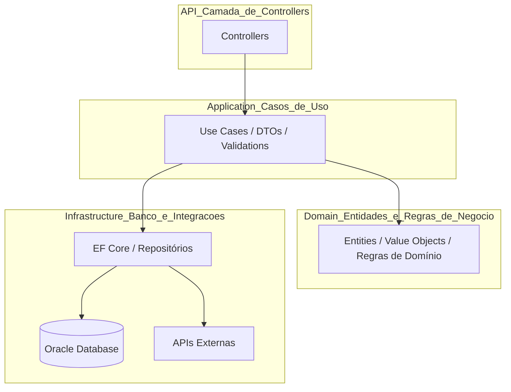

# 🍽️ Sistema de Atendimentos de Restaurante

Este projeto é uma **API RESTful desenvolvida em .NET 8** para o gerenciamento completo de atendimentos em um restaurante, incluindo controle de **mesas, garçons, comandas e clientes**.  
O objetivo é oferecer uma base sólida e escalável para sistemas de gestão de atendimento, integrando **banco de dados Oracle** e **boas práticas de arquitetura limpa (Clean Architecture)**.

---

## 🧭 Índice

1. [🎯 Objetivo e Escopo](#-objetivo-e-escopo)  
2. [🧩 Visão Geral e Arquitetura](#-visão-geral-e-arquitetura)  
3. [⚙️ Tecnologias Utilizadas](#️-tecnologias-utilizadas)  
4. [📋 Requisitos do Sistema](#-requisitos-do-sistema)  
5. [🏗️ Estrutura do Projeto](#️-estrutura-do-projeto)  
6. [🗃️ Entidades Principais](#️-entidades-principais)  
7. [🚀 Configuração e Execução](#-configuração-e-execução)  
8. [🧱 Migrations e Banco de Dados](#-migrations-e-banco-de-dados)  
9. [🌐 Endpoints Principais (Swagger)](#-endpoints-principais-swagger)  
10. [💾 Exemplos de Uso (Swagger)](#-exemplos-de-uso-swagger)  
11. [🧠 Regras de Negócio Implementadas](#-regras-de-negócio-implementadas)  
12. [👥 Integrantes do Grupo](#-integrantes-do-grupo)  

---

## 🎯 Objetivo e Escopo

O **Sistema de Atendimentos de Restaurante** tem como objetivo digitalizar e automatizar o fluxo de atendimento, desde o cadastro de mesas até o fechamento da comanda.

**Escopo do projeto:**
- Cadastro e gerenciamento de mesas, garçons e clientes.  
- Abertura e fechamento de comandas.  
- Registro de pedidos e cálculo automático do valor total.  
- Persistência em banco de dados Oracle.  
- Exposição de API RESTful documentada via Swagger.  

---

## 🧩 Visão Geral e Arquitetura

O projeto segue o padrão **Domain-Driven Design (DDD)** e aplica a **Clean Architecture**, garantindo separação de responsabilidades, facilidade de manutenção e baixo acoplamento entre camadas.



---

## ⚙️ Tecnologias Utilizadas

| Categoria | Tecnologia |
|------------|-------------|
| Linguagem | **C# (.NET 8)** |
| Framework Web | **ASP.NET Core Web API** |
| ORM | **Entity Framework Core (Oracle Provider)** |
| Banco de Dados | **Oracle Database (FIAP Cloud)** |
| Documentação | **Swagger / Swashbuckle** |
| Injeção de Dependência | **Built-in DI** |
| Mapeamento de Objetos | **AutoMapper** |
| Validação | **FluentValidation** |
| Logs | **Serilog** |
| Testes Unitários | **xUnit + FluentAssertions** |
| Versionamento | **Git + GitHub** |

---

## 📋 Requisitos do Sistema

### **Requisitos Funcionais (RF)**
- RF01 – Cadastrar mesas, garçons e clientes.  
- RF02 – Abrir e fechar comandas.  
- RF03 – Adicionar itens à comanda.  
- RF04 – Consultar mesas e comandas abertas.  
- RF05 – Calcular automaticamente o valor total da comanda.  
- RF06 – Atualizar status das mesas (Disponível, Ocupada, Reservada).  

### **Requisitos Não Funcionais (RNF)**
- RNF01 – Utilizar arquitetura limpa (Clean Architecture).  
- RNF02 – Persistência com Entity Framework Core e Oracle.  
- RNF03 – Retornar erros padronizados (HTTP + ProblemDetails).  
- RNF04 – Documentar endpoints com Swagger.  
- RNF05 – Disponibilidade mínima de 99%.  
- RNF06 – Tempo médio de resposta inferior a 200ms.  
- RNF07 – Logs estruturados com Serilog.  

---

## 🏗️ Estrutura do Projeto

```bash
atendimentos/
│
├── src/
│   ├── Atendimentos.Api/                            # 🎯 Camada de apresentação (controllers)
│   ├── Atendimentos.Application/                    # ⚙️ Casos de uso e DTOs
│   ├── Atendimentos.Domain/                         # 🧩 Entidades e regras de negócio
│   ├── Atendimentos.Infrastructure/                 # 🗄️ Banco e repositórios (EF Core)
│   └── Atendimentos.Tests/                          # 🧪 Testes unitários
│
└── README.md
```
```bash
atendimentos/
│
├── src/
│   ├── Atendimentos.Api/                            # 🎯 Camada de apresentação (endpoints / controllers)
│   │   ├── Controllers/
│   │   │   ├── MesasController.cs
│   │   │   ├── GarconsController.cs
│   │   │   ├── ComandasController.cs
│   │   │   └── ClientesController.cs
│   │   ├── Program.cs                               # Configuração de serviços e DI
│   │   └── appsettings.json                         # Configuração de banco e ambiente
│   │
│   ├── Atendimentos.Application/                    # ⚙️ Camada de aplicação (serviços e DTOs)
│   │   └── Services/
│   │       ├── MesaService.cs
│   │       ├── GarcomService.cs
│   │       ├── ComandaService.cs
│   │       └── ClienteService.cs
│   │
│   ├── Atendimentos.Domain/                         # 🧩 Camada de domínio (entidades e interfaces)
│   │   ├── Entities/
│   │   │   ├── Mesa.cs
│   │   │   ├── Garcom.cs
│   │   │   ├── Comanda.cs
│   │   │   └── Cliente.cs
│   │   └── Repositories/
│   │       ├── IMesaRepository.cs
│   │       ├── IGarcomRepository.cs
│   │       ├── IComandaRepository.cs
│   │       └── IClienteRepository.cs
│   │
│   ├── Atendimentos.Infrastructure/                 # 🗄️ Camada de infraestrutura (banco, repositórios)
│   │   ├── Context/
│   │   │   └── AtendimentosDbContext.cs
│   │   ├── Repositories/
│   │   │   ├── MesaRepository.cs
│   │   │   ├── GarcomRepository.cs
│   │   │   ├── ComandaRepository.cs
│   │   │   └── ClienteRepository.cs
│   │   └── Migrations/                              # Migrações do Entity Framework
│   │       ├── 2025xxxxxx_InitialCreate.cs
│   │       ├── AddGarcom.cs
│   │       ├── AddComandaTable.cs
│   │       └── AddClienteTable.cs
│   │
│   └── Atendimentos.Tests/                          # 🧪 Estrutura para testes unitários
│       └── (futuros testes automatizados)
│
└── README.md                                        # 📘 Documentação do projeto
```
---

## 🗃️ Entidades Principais

### 🪑 Mesa
- `Numero`
- `Capacidade`
- `Status`
- `Localizacao`

### 🧑‍🍳 Garçom
- `Nome`
- `Matricula`
- `Telefone`
- `Ativo`

### 🧾 Comanda
- `MesaId`
- `GarcomId`
- `ClienteId`
- `Status`
- `DataAbertura`
- `DataFechamento`
- `ValorTotal`

### 👤 Cliente
- `Nome`
- `CPF`
- `Telefone`

---

## 🚀 Configuração e Execução

### 1️⃣ Restaurar dependências
```bash
dotnet restore
```

### 2️⃣ Compilar o projeto
```bash
dotnet build
```

### 3️⃣ Rodar as migrações
```bash
dotnet ef database update --project src/Atendimentos.Infrastructure --startup-project src/Atendimentos.Api
```

### 4️⃣ Executar a API
```bash
dotnet run --project src/Atendimentos.Api
```
Acesse: 👉 [http://localhost:5070/swagger](http://localhost:5070/swagger)

---

## 🧱 Migrations e Banco de Dados

A aplicação utiliza **Entity Framework Core** com **Oracle Database**.  
Cada entidade possui uma migration associada para controle de versão do esquema.

---

## 🌐 Endpoints Principais (Swagger)

| Entidade | Método | Endpoint | Descrição |
|-----------|---------|-----------|------------|
| **Mesas** | GET | `/api/mesas` | Lista mesas |
|  | POST | `/api/mesas` | Cria mesa |
|  | PUT | `/api/mesas/{id}` | Atualiza mesa |
| **Garçons** | GET | `/api/garcons` | Lista garçons |
|  | POST | `/api/garcons` | Cria garçom |
| **Comandas** | POST | `/api/comandas` | Abre comanda |
|  | PUT | `/api/comandas/{id}/fechar` | Fecha comanda |
| **Clientes** | GET | `/api/clientes` | Lista clientes |
|  | POST | `/api/clientes` | Cria cliente |

---

## 💾 Exemplos de Uso (Swagger)

### Criar Cliente
```json
POST /api/clientes
{
  "nome": "Maria Eduarda Araujo Penas",
  "cpf": "12345678900",
  "telefone": "11999998888"
}
```

### Criar Mesa
```json
POST /api/mesas
{
  "numero": 3,
  "capacidade": 4,
  "localizacao": "Varanda"
}
```

### Criar Garçom
```json
POST /api/garcons
{
  "nome": "Carlos Silva",
  "matricula": "G001",
  "telefone": "11911112222"
}
```

### Abrir Comanda
```bash
POST /api/comandas?mesaId={mesa-guid}&garcomId={garcom-guid}
```

---

## 🧠 Regras de Negócio Implementadas

- Uma **comanda só pode ser aberta** se a mesa estiver **Disponível**.  
- Ao **fechar uma comanda**, o status da mesa muda automaticamente para **Disponível**.  
- **Garçons inativos** não podem abrir comandas.  
- **Clientes** podem ser vinculados a **várias comandas**.  
- Controle de **timestamps automáticos** para auditoria.  
- Regras de negócio validadas via **entidades de domínio e exceções customizadas**.
- 

## ☁️ DevOps Tools & Cloud Computing

### 📦 Implantação e Infraestrutura

Este projeto foi parte integrante do **Checkpoint Final da disciplina de DevOps Tools & Cloud Computing**, com foco em **provisionamento de ambiente na nuvem, conteinerização e orquestração de múltiplas APIs**.

A infraestrutura foi criada em uma **máquina virtual Linux (Ubuntu 22.04 LTS)** hospedada na **Microsoft Azure**, onde foram instalados **Docker** e **Docker Compose**.

---

## 🐳 Orquestração com Docker Compose

O arquivo `docker-compose.yml` define a orquestração de três containers — **Oracle XE**, **API Pedix (Java)** e **API Atendimentos (.NET)** — conectados por uma rede Docker interna chamada **`pedix-network`**.  
Ele garante que o **banco de dados suba primeiro**, e só depois as **APIs sejam inicializadas**, já configuradas com variáveis de ambiente apontando para o Oracle.

### 📦 Estrutura da Orquestração

| Serviço                | Container            | Porta Interna | Porta Externa | Imagem Base                                 |
| ---------------------- | -------------------- | ------------- | -------------- | -------------------------------------------|
| Banco Oracle XE        | `oracle`             | 1521          | 1521           | `gvenzl/oracle-xe:21-slim`                 |
| API Java (Pedix)       | `pedix-api`          | 8080          | 8080           | `eclipse-temurin:21-jdk-alpine`            |
| API .NET (Atendimentos)| `atendimentos-api`   | 8080          | 8081           | `mcr.microsoft.com/dotnet/aspnet:8.0-slim` |

Todos os containers estão conectados pela mesma rede (`pedix-network`) e utilizam volumes persistentes (`oracle-data`) para manter os dados salvos mesmo após a reinicialização.

---

### ⚙️ Execução na Nuvem (VM Azure)

Após clonar os repositórios (`pedix-api` e `atendimentos-api`) na VM, a stack foi executada com o comando:

```bash
sudo docker-compose up -d --build
```

Os três containers foram inicializados com sucesso e verificados via:
```
sudo docker ps
```

## 📸 Evidências incluídas no PDF da entrega:

* Containers Up (healthy)

* Logs do Oracle (DATABASE IS READY TO USE!)

* Swagger das APIs acessíveis via IP público:

* http://<ip-da-vm>:8080/swagger-ui/index.html

* http://<ip-da-vm>:8081/swagger/index.html

---

🔗 Repositórios e Evidências

| Item                           | Link                                                                                               |
| ------------------------------ | -------------------------------------------------------------------------------------------------- |
| ☕ **Pedix API (Java)**         | [https://github.com/alanerochaa/pedix-api](https://github.com/alanerochaa/pedix-api)               |
| 🧩 **Atendimentos API (.NET)** | [https://github.com/alanerochaa/atendimentos-api](https://github.com/alanerochaa/atendimentos-api) |
| 📹 **Vídeo da Demonstração**   | [insira aqui o link do vídeo no YouTube]                                                           |
| 📄 **PDF de Evidências**       | Arquivo entregue na plataforma FIAP                                                                |


---

## 🧠 Tecnologias e Boas Práticas Utilizadas

Infraestrutura como Serviço (IaaS) – provisionamento de VM no Azure

Dockerfile multi-stage build – otimização de imagem

Docker Compose – orquestração de múltiplos serviços

Imagens slim/alpine – redução de tamanho e tempo de build

Execução em background (-d) – serviços rodando em modo daemon

Isolamento de usuário não root nos containers


> O projeto foi implantado com sucesso em ambiente cloud, utilizando Docker Compose para integrar as APIs Java e .NET com o banco Oracle XE.
> A execução foi validada por meio do Swagger, confirmando a comunicação entre os serviços e o funcionamento completo da stack.

---

## 👥 Integrantes do Grupo

| Nome | RM | Função |
|-------|-----|--------|
| **Maria Eduarda Araujo Penas** | RM560944 | Desenvolvedora Backend |
| **Alane Rocha da Sila** | RM561052 | Desenvolvedora Backend |
| **Anna Beatriz de Araujo Bonfim** | RM559561 | Desenvolvedora Front/Infra |

---
