```mermaid
flowchart TD
    subgraph Presentation [🎯 API - Camada de Apresentação]
        A[Controllers]
    end

    subgraph Application [⚙️ Application - Casos de Uso / Serviços]
        B[Use Cases / DTOs / Validations]
    end

    subgraph Domain [🧩 Domain - Entidades e Regras de Negócio]
        C[Entities / Value Objects / Regras de Domínio]
    end

    subgraph Infrastructure [🗄️ Infrastructure - Banco e Integrações]
        D[EF Core / Repositórios]
        E[(Oracle Database)]
        F[External APIs]
    end

    A --> B
    B --> C
    B --> D
    D --> E
    D --> F

```

# 🍽️ Sistema de Atendimentos de Restaurante

Este projeto é uma **API RESTful desenvolvida em .NET 8** para o gerenciamento completo de atendimentos em um restaurante, incluindo controle de **mesas, garçons, comandas e clientes**.  
O objetivo é oferecer uma base sólida e escalável para sistemas de gestão de atendimento, integrando **banco de dados Oracle** e **boas práticas de arquitetura limpa (Clean Architecture)**.

---

## 🧭 Índice

1. [🎯 Objetivo e Escopo](#-objetivo-e-escopo)  
2. [🧩 Visão Geral e Arquitetura](#-visão-geral-e-arquitetura)  
3. [⚙️ Tecnologias Utilizadas](#️-tecnologias-utilizadas)  
4. [📋 Requisitos do Sistema](#-requisitos-do-sistema)  
5. [🏗️ Estrutura do Projeto](#️-estrutura-do-projeto)  
6. [🗃️ Entidades Principais](#️-entidades-principais)  
7. [🚀 Configuração e Execução](#-configuração-e-execução)  
8. [🧱 Migrations e Banco de Dados](#-migrations-e-banco-de-dados)  
9. [🌐 Endpoints Principais (Swagger)](#-endpoints-principais-swagger)  
10. [💾 Exemplos de Uso (Swagger)](#-exemplos-de-uso-swagger)  
11. [🧠 Regras de Negócio Implementadas](#-regras-de-negócio-implementadas)  
12. [👥 Integrantes do Grupo](#-integrantes-do-grupo)  

---

## 🎯 Objetivo e Escopo

O **Sistema de Atendimentos de Restaurante** tem como objetivo digitalizar e automatizar o fluxo de atendimento, desde o cadastro de mesas até o fechamento da comanda.

**Escopo do projeto:**
- Cadastro e gerenciamento de mesas, garçons e clientes.  
- Abertura e fechamento de comandas.  
- Registro de pedidos e cálculo automático do valor total.  
- Persistência em banco de dados Oracle.  
- Exposição de API RESTful documentada via Swagger.  

---

## 🧩 Visão Geral e Arquitetura

O projeto segue o padrão **Domain-Driven Design (DDD)** e aplica a **Clean Architecture**, garantindo separação de responsabilidades, facilidade de manutenção e baixo acoplamento entre camadas.

```mermaid
flowchart LR
API[API (Controllers)] --> APP[Application (Use Cases / Services)]
APP --> DOM[Domain (Entities / Rules)]
APP --> INFRA[Infrastructure (EF Core / Repositories)]
INFRA --> DB[(Oracle Database)]
INFRA --> EXT[External APIs]
```

---

## ⚙️ Tecnologias Utilizadas

| Categoria | Tecnologia |
|------------|-------------|
| Linguagem | **C# (.NET 8)** |
| Framework Web | **ASP.NET Core Web API** |
| ORM | **Entity Framework Core (Oracle Provider)** |
| Banco de Dados | **Oracle Database (FIAP Cloud)** |
| Documentação | **Swagger / Swashbuckle** |
| Injeção de Dependência | **Built-in DI** |
| Mapeamento de Objetos | **AutoMapper** |
| Validação | **FluentValidation** |
| Logs | **Serilog** |
| Testes Unitários | **xUnit + FluentAssertions** |
| Versionamento | **Git + GitHub** |

---

## 📋 Requisitos do Sistema

### **Requisitos Funcionais (RF)**
- RF01 – Cadastrar mesas, garçons e clientes.  
- RF02 – Abrir e fechar comandas.  
- RF03 – Adicionar itens à comanda.  
- RF04 – Consultar mesas e comandas abertas.  
- RF05 – Calcular automaticamente o valor total da comanda.  
- RF06 – Atualizar status das mesas (Disponível, Ocupada, Reservada).  

### **Requisitos Não Funcionais (RNF)**
- RNF01 – Utilizar arquitetura limpa (Clean Architecture).  
- RNF02 – Persistência com Entity Framework Core e Oracle.  
- RNF03 – Retornar erros padronizados (HTTP + ProblemDetails).  
- RNF04 – Documentar endpoints com Swagger.  
- RNF05 – Disponibilidade mínima de 99%.  
- RNF06 – Tempo médio de resposta inferior a 200ms.  
- RNF07 – Logs estruturados com Serilog.  

---

## 🏗️ Estrutura do Projeto

```bash
atendimentos/
│
├── src/
│   ├── Atendimentos.Api/                            # 🎯 Camada de apresentação (controllers)
│   ├── Atendimentos.Application/                    # ⚙️ Casos de uso e DTOs
│   ├── Atendimentos.Domain/                         # 🧩 Entidades e regras de negócio
│   ├── Atendimentos.Infrastructure/                 # 🗄️ Banco e repositórios (EF Core)
│   └── Atendimentos.Tests/                          # 🧪 Testes unitários
│
└── README.md
```

---

## 🗃️ Entidades Principais

### 🪑 Mesa
- `Numero`
- `Capacidade`
- `Status`
- `Localizacao`

### 🧑‍🍳 Garçom
- `Nome`
- `Matricula`
- `Telefone`
- `Ativo`

### 🧾 Comanda
- `MesaId`
- `GarcomId`
- `ClienteId`
- `Status`
- `DataAbertura`
- `DataFechamento`
- `ValorTotal`

### 👤 Cliente
- `Nome`
- `CPF`
- `Telefone`

---

## 🚀 Configuração e Execução

### 1️⃣ Restaurar dependências
```bash
dotnet restore
```

### 2️⃣ Compilar o projeto
```bash
dotnet build
```

### 3️⃣ Rodar as migrações
```bash
dotnet ef database update --project src/Atendimentos.Infrastructure --startup-project src/Atendimentos.Api
```

### 4️⃣ Executar a API
```bash
dotnet run --project src/Atendimentos.Api
```
Acesse: 👉 [http://localhost:5070/swagger](http://localhost:5070/swagger)

---

## 🧱 Migrations e Banco de Dados

A aplicação utiliza **Entity Framework Core** com **Oracle Database**.  
Cada entidade possui uma migration associada para controle de versão do esquema.

---

## 🌐 Endpoints Principais (Swagger)

| Entidade | Método | Endpoint | Descrição |
|-----------|---------|-----------|------------|
| **Mesas** | GET | `/api/mesas` | Lista mesas |
|  | POST | `/api/mesas` | Cria mesa |
|  | PUT | `/api/mesas/{id}` | Atualiza mesa |
| **Garçons** | GET | `/api/garcons` | Lista garçons |
|  | POST | `/api/garcons` | Cria garçom |
| **Comandas** | POST | `/api/comandas` | Abre comanda |
|  | PUT | `/api/comandas/{id}/fechar` | Fecha comanda |
| **Clientes** | GET | `/api/clientes` | Lista clientes |
|  | POST | `/api/clientes` | Cria cliente |

---

## 💾 Exemplos de Uso (Swagger)

### Criar Cliente
```json
POST /api/clientes
{
  "nome": "Maria Eduarda Araujo Penas",
  "cpf": "12345678900",
  "telefone": "11999998888"
}
```

### Criar Mesa
```json
POST /api/mesas
{
  "numero": 3,
  "capacidade": 4,
  "localizacao": "Varanda"
}
```

### Criar Garçom
```json
POST /api/garcons
{
  "nome": "Carlos Silva",
  "matricula": "G001",
  "telefone": "11911112222"
}
```

### Abrir Comanda
```bash
POST /api/comandas?mesaId={mesa-guid}&garcomId={garcom-guid}
```

---

## 🧠 Regras de Negócio Implementadas

- Uma **comanda só pode ser aberta** se a mesa estiver **Disponível**.  
- Ao **fechar uma comanda**, o status da mesa muda automaticamente para **Disponível**.  
- **Garçons inativos** não podem abrir comandas.  
- **Clientes** podem ser vinculados a **várias comandas**.  
- Controle de **timestamps automáticos** para auditoria.  
- Regras de negócio validadas via **entidades de domínio e exceções customizadas**.

---

## 👥 Integrantes do Grupo

| Nome | RM | Função |
|-------|-----|--------|
| **Maria Eduarda Araujo Penas** | RM560944 | Desenvolvedora Full Stack |
| **Alane Rocha da Sila** | RM561052 | Desenvolvedora Backend |
| **Anna Beatriz de Araujo Bonfim** | RM559561 | Desenvolvedora Front/Infra |

# 🍽️ Sistema de Atendimentos de Restaurante

Este projeto é uma **API RESTful desenvolvida em .NET 8** para o gerenciamento completo de atendimentos em um restaurante, incluindo controle de **mesas, garçons, comandas e clientes**.  
O objetivo é oferecer uma base sólida e escalável para sistemas de gestão de atendimento, integrando **banco de dados Oracle** e **boas práticas de arquitetura limpa (Clean Architecture)**.

---

## 🧭 Índice

1. [🎯 Objetivo e Escopo](#-objetivo-e-escopo)  
2. [🧩 Visão Geral e Arquitetura](#-visão-geral-e-arquitetura)  
3. [⚙️ Tecnologias Utilizadas](#️-tecnologias-utilizadas)  
4. [📋 Requisitos do Sistema](#-requisitos-do-sistema)  
5. [🏗️ Estrutura do Projeto](#️-estrutura-do-projeto)  
6. [🗃️ Entidades Principais](#️-entidades-principais)  
7. [🚀 Configuração e Execução](#-configuração-e-execução)  
8. [🧱 Migrations e Banco de Dados](#-migrations-e-banco-de-dados)  
9. [🌐 Endpoints Principais (Swagger)](#-endpoints-principais-swagger)  
10. [💾 Exemplos de Uso (Swagger)](#-exemplos-de-uso-swagger)  
11. [🧠 Regras de Negócio Implementadas](#-regras-de-negócio-implementadas)  
12. [👥 Integrantes do Grupo](#-integrantes-do-grupo)  

---

## 🎯 Objetivo e Escopo

O **Sistema de Atendimentos de Restaurante** tem como objetivo digitalizar e automatizar o fluxo de atendimento, desde o cadastro de mesas até o fechamento da comanda.

**Escopo do projeto:**
- Cadastro e gerenciamento de mesas, garçons e clientes.  
- Abertura e fechamento de comandas.  
- Registro de pedidos e cálculo automático do valor total.  
- Persistência em banco de dados Oracle.  
- Exposição de API RESTful documentada via Swagger.  

---

## 🧩 Visão Geral e Arquitetura

O projeto segue o padrão **Domain-Driven Design (DDD)** e aplica a **Clean Architecture**, garantindo separação de responsabilidades, facilidade de manutenção e baixo acoplamento entre camadas.

```mermaid
flowchart LR
API[API (Controllers)] --> APP[Application (Use Cases / Services)]
APP --> DOM[Domain (Entities / Rules)]
APP --> INFRA[Infrastructure (EF Core / Repositories)]
INFRA --> DB[(Oracle Database)]
INFRA --> EXT[External APIs]
```

---

## ⚙️ Tecnologias Utilizadas

| Categoria | Tecnologia |
|------------|-------------|
| Linguagem | **C# (.NET 8)** |
| Framework Web | **ASP.NET Core Web API** |
| ORM | **Entity Framework Core (Oracle Provider)** |
| Banco de Dados | **Oracle Database (FIAP Cloud)** |
| Documentação | **Swagger / Swashbuckle** |
| Injeção de Dependência | **Built-in DI** |
| Mapeamento de Objetos | **AutoMapper** |
| Validação | **FluentValidation** |
| Logs | **Serilog** |
| Testes Unitários | **xUnit + FluentAssertions** |
| Versionamento | **Git + GitHub** |

---

## 📋 Requisitos do Sistema

### **Requisitos Funcionais (RF)**
- RF01 – Cadastrar mesas, garçons e clientes.  
- RF02 – Abrir e fechar comandas.  
- RF03 – Adicionar itens à comanda.  
- RF04 – Consultar mesas e comandas abertas.  
- RF05 – Calcular automaticamente o valor total da comanda.  
- RF06 – Atualizar status das mesas (Disponível, Ocupada, Reservada).  

### **Requisitos Não Funcionais (RNF)**
- RNF01 – Utilizar arquitetura limpa (Clean Architecture).  
- RNF02 – Persistência com Entity Framework Core e Oracle.  
- RNF03 – Retornar erros padronizados (HTTP + ProblemDetails).  
- RNF04 – Documentar endpoints com Swagger.  
- RNF05 – Disponibilidade mínima de 99%.  
- RNF06 – Tempo médio de resposta inferior a 200ms.  
- RNF07 – Logs estruturados com Serilog.  

---

## 🏗️ Estrutura do Projeto

```bash
atendimentos/
│
├── src/
│   ├── Atendimentos.Api/                            # 🎯 Camada de apresentação (controllers)
│   ├── Atendimentos.Application/                    # ⚙️ Casos de uso e DTOs
│   ├── Atendimentos.Domain/                         # 🧩 Entidades e regras de negócio
│   ├── Atendimentos.Infrastructure/                 # 🗄️ Banco e repositórios (EF Core)
│   └── Atendimentos.Tests/                          # 🧪 Testes unitários
│
└── README.md
```

---

## 🗃️ Entidades Principais

### 🪑 Mesa
- `Numero`
- `Capacidade`
- `Status`
- `Localizacao`

### 🧑‍🍳 Garçom
- `Nome`
- `Matricula`
- `Telefone`
- `Ativo`

### 🧾 Comanda
- `MesaId`
- `GarcomId`
- `ClienteId`
- `Status`
- `DataAbertura`
- `DataFechamento`
- `ValorTotal`

### 👤 Cliente
- `Nome`
- `CPF`
- `Telefone`

---

## 🚀 Configuração e Execução

### 1️⃣ Restaurar dependências
```bash
dotnet restore
```

### 2️⃣ Compilar o projeto
```bash
dotnet build
```

### 3️⃣ Rodar as migrações
```bash
dotnet ef database update --project src/Atendimentos.Infrastructure --startup-project src/Atendimentos.Api
```

### 4️⃣ Executar a API
```bash
dotnet run --project src/Atendimentos.Api
```
Acesse: 👉 [http://localhost:5070/swagger](http://localhost:5070/swagger)

---

## 🧱 Migrations e Banco de Dados

A aplicação utiliza **Entity Framework Core** com **Oracle Database**.  
Cada entidade possui uma migration associada para controle de versão do esquema.

---

## 🌐 Endpoints Principais (Swagger)

| Entidade | Método | Endpoint | Descrição |
|-----------|---------|-----------|------------|
| **Mesas** | GET | `/api/mesas` | Lista mesas |
|  | POST | `/api/mesas` | Cria mesa |
|  | PUT | `/api/mesas/{id}` | Atualiza mesa |
| **Garçons** | GET | `/api/garcons` | Lista garçons |
|  | POST | `/api/garcons` | Cria garçom |
| **Comandas** | POST | `/api/comandas` | Abre comanda |
|  | PUT | `/api/comandas/{id}/fechar` | Fecha comanda |
| **Clientes** | GET | `/api/clientes` | Lista clientes |
|  | POST | `/api/clientes` | Cria cliente |

---

## 💾 Exemplos de Uso (Swagger)

### Criar Cliente
```json
POST /api/clientes
{
  "nome": "Maria Eduarda Araujo Penas",
  "cpf": "12345678900",
  "telefone": "11999998888"
}
```

### Criar Mesa
```json
POST /api/mesas
{
  "numero": 3,
  "capacidade": 4,
  "localizacao": "Varanda"
}
```

### Criar Garçom
```json
POST /api/garcons
{
  "nome": "Carlos Silva",
  "matricula": "G001",
  "telefone": "11911112222"
}
```

### Abrir Comanda
```bash
POST /api/comandas?mesaId={mesa-guid}&garcomId={garcom-guid}
```

---

## 🧠 Regras de Negócio Implementadas

- Uma **comanda só pode ser aberta** se a mesa estiver **Disponível**.  
- Ao **fechar uma comanda**, o status da mesa muda automaticamente para **Disponível**.  
- **Garçons inativos** não podem abrir comandas.  
- **Clientes** podem ser vinculados a **várias comandas**.  
- Controle de **timestamps automáticos** para auditoria.  
- Regras de negócio validadas via **entidades de domínio e exceções customizadas**.

---

## 👥 Integrantes do Grupo

| Nome | RM | Função |
|-------|-----|--------|
| **Maria Eduarda Araujo Penas** | RM560944 | Desenvolvedora Full Stack |
| **Alane Rocha da Sila** | RM561052 | Desenvolvedora Backend |
| **Anna Beatriz de Araujo Bonfim** | RM559561 | Desenvolvedora Front/Infra |


# 🍽️ Sistema de Atendimentos de Restaurante

Este projeto é uma **API RESTful desenvolvida em .NET 8** para o gerenciamento completo de atendimentos em um restaurante, incluindo controle de **mesas, garçons, comandas e clientes**.  
O objetivo é oferecer uma base sólida e escalável para sistemas de gestão de atendimento, integrando **banco de dados Oracle** e **boas práticas de arquitetura limpa (Clean Architecture)**.

---

## 🧭 Índice

1. [🎯 Objetivo e Escopo](#-objetivo-e-escopo)  
2. [🧩 Visão Geral e Arquitetura](#-visão-geral-e-arquitetura)  
3. [⚙️ Tecnologias Utilizadas](#️-tecnologias-utilizadas)  
4. [📋 Requisitos do Sistema](#-requisitos-do-sistema)  
5. [🏗️ Estrutura do Projeto](#️-estrutura-do-projeto)  
6. [🗃️ Entidades Principais](#️-entidades-principais)  
7. [🚀 Configuração e Execução](#-configuração-e-execução)  
8. [🧱 Migrations e Banco de Dados](#-migrations-e-banco-de-dados)  
9. [🌐 Endpoints Principais (Swagger)](#-endpoints-principais-swagger)  
10. [💾 Exemplos de Uso (Swagger)](#-exemplos-de-uso-swagger)  
11. [🧠 Regras de Negócio Implementadas](#-regras-de-negócio-implementadas)  
12. [👥 Integrantes do Grupo](#-integrantes-do-grupo)  

---

## 🎯 Objetivo e Escopo

O **Sistema de Atendimentos de Restaurante** tem como objetivo digitalizar e automatizar o fluxo de atendimento, desde o cadastro de mesas até o fechamento da comanda.

**Escopo do projeto:**
- Cadastro e gerenciamento de mesas, garçons e clientes.  
- Abertura e fechamento de comandas.  
- Registro de pedidos e cálculo automático do valor total.  
- Persistência em banco de dados Oracle.  
- Exposição de API RESTful documentada via Swagger.  

---

## 🧩 Visão Geral e Arquitetura

O projeto segue o padrão **Domain-Driven Design (DDD)** e aplica a **Clean Architecture**, garantindo separação de responsabilidades, facilidade de manutenção e baixo acoplamento entre camadas.



---

## ⚙️ Tecnologias Utilizadas

| Categoria | Tecnologia |
|------------|-------------|
| Linguagem | **C# (.NET 8)** |
| Framework Web | **ASP.NET Core Web API** |
| ORM | **Entity Framework Core (Oracle Provider)** |
| Banco de Dados | **Oracle Database (FIAP Cloud)** |
| Documentação | **Swagger / Swashbuckle** |
| Injeção de Dependência | **Built-in DI** |
| Mapeamento de Objetos | **AutoMapper** |
| Validação | **FluentValidation** |
| Logs | **Serilog** |
| Testes Unitários | **xUnit + FluentAssertions** |
| Versionamento | **Git + GitHub** |

---

## 📋 Requisitos do Sistema

### **Requisitos Funcionais (RF)**
- RF01 – Cadastrar mesas, garçons e clientes.  
- RF02 – Abrir e fechar comandas.  
- RF03 – Adicionar itens à comanda.  
- RF04 – Consultar mesas e comandas abertas.  
- RF05 – Calcular automaticamente o valor total da comanda.  
- RF06 – Atualizar status das mesas (Disponível, Ocupada, Reservada).  

### **Requisitos Não Funcionais (RNF)**
- RNF01 – Utilizar arquitetura limpa (Clean Architecture).  
- RNF02 – Persistência com Entity Framework Core e Oracle.  
- RNF03 – Retornar erros padronizados (HTTP + ProblemDetails).  
- RNF04 – Documentar endpoints com Swagger.  
- RNF05 – Disponibilidade mínima de 99%.  
- RNF06 – Tempo médio de resposta inferior a 200ms.  
- RNF07 – Logs estruturados com Serilog.  

---

## 🏗️ Estrutura do Projeto

```bash
atendimentos/
│
├── src/
│   ├── Atendimentos.Api/                            # 🎯 Camada de apresentação (controllers)
│   ├── Atendimentos.Application/                    # ⚙️ Casos de uso e DTOs
│   ├── Atendimentos.Domain/                         # 🧩 Entidades e regras de negócio
│   ├── Atendimentos.Infrastructure/                 # 🗄️ Banco e repositórios (EF Core)
│   └── Atendimentos.Tests/                          # 🧪 Testes unitários
│
└── README.md
```
```bash
atendimentos/
│
├── src/
│   ├── Atendimentos.Api/                            # 🎯 Camada de apresentação (endpoints / controllers)
│   │   ├── Controllers/
│   │   │   ├── MesasController.cs
│   │   │   ├── GarconsController.cs
│   │   │   ├── ComandasController.cs
│   │   │   └── ClientesController.cs
│   │   ├── Program.cs                               # Configuração de serviços e DI
│   │   └── appsettings.json                         # Configuração de banco e ambiente
│   │
│   ├── Atendimentos.Application/                    # ⚙️ Camada de aplicação (serviços e DTOs)
│   │   └── Services/
│   │       ├── MesaService.cs
│   │       ├── GarcomService.cs
│   │       ├── ComandaService.cs
│   │       └── ClienteService.cs
│   │
│   ├── Atendimentos.Domain/                         # 🧩 Camada de domínio (entidades e interfaces)
│   │   ├── Entities/
│   │   │   ├── Mesa.cs
│   │   │   ├── Garcom.cs
│   │   │   ├── Comanda.cs
│   │   │   └── Cliente.cs
│   │   └── Repositories/
│   │       ├── IMesaRepository.cs
│   │       ├── IGarcomRepository.cs
│   │       ├── IComandaRepository.cs
│   │       └── IClienteRepository.cs
│   │
│   ├── Atendimentos.Infrastructure/                 # 🗄️ Camada de infraestrutura (banco, repositórios)
│   │   ├── Context/
│   │   │   └── AtendimentosDbContext.cs
│   │   ├── Repositories/
│   │   │   ├── MesaRepository.cs
│   │   │   ├── GarcomRepository.cs
│   │   │   ├── ComandaRepository.cs
│   │   │   └── ClienteRepository.cs
│   │   └── Migrations/                              # Migrações do Entity Framework
│   │       ├── 2025xxxxxx_InitialCreate.cs
│   │       ├── AddGarcom.cs
│   │       ├── AddComandaTable.cs
│   │       └── AddClienteTable.cs
│   │
│   └── Atendimentos.Tests/                          # 🧪 Estrutura para testes unitários
│       └── (futuros testes automatizados)
│
└── README.md                                        # 📘 Documentação do projeto
```
---

## 🗃️ Entidades Principais

### 🪑 Mesa
- `Numero`
- `Capacidade`
- `Status`
- `Localizacao`

### 🧑‍🍳 Garçom
- `Nome`
- `Matricula`
- `Telefone`
- `Ativo`

### 🧾 Comanda
- `MesaId`
- `GarcomId`
- `ClienteId`
- `Status`
- `DataAbertura`
- `DataFechamento`
- `ValorTotal`

### 👤 Cliente
- `Nome`
- `CPF`
- `Telefone`

---

## 🚀 Configuração e Execução

### 1️⃣ Restaurar dependências
```bash
dotnet restore
```

### 2️⃣ Compilar o projeto
```bash
dotnet build
```

### 3️⃣ Rodar as migrações
```bash
dotnet ef database update --project src/Atendimentos.Infrastructure --startup-project src/Atendimentos.Api
```

### 4️⃣ Executar a API
```bash
dotnet run --project src/Atendimentos.Api
```
Acesse: 👉 [http://localhost:5070/swagger](http://localhost:5070/swagger)

---

## 🧱 Migrations e Banco de Dados

A aplicação utiliza **Entity Framework Core** com **Oracle Database**.  
Cada entidade possui uma migration associada para controle de versão do esquema.

---

## 🌐 Endpoints Principais (Swagger)

| Entidade | Método | Endpoint | Descrição |
|-----------|---------|-----------|------------|
| **Mesas** | GET | `/api/mesas` | Lista mesas |
|  | POST | `/api/mesas` | Cria mesa |
|  | PUT | `/api/mesas/{id}` | Atualiza mesa |
| **Garçons** | GET | `/api/garcons` | Lista garçons |
|  | POST | `/api/garcons` | Cria garçom |
| **Comandas** | POST | `/api/comandas` | Abre comanda |
|  | PUT | `/api/comandas/{id}/fechar` | Fecha comanda |
| **Clientes** | GET | `/api/clientes` | Lista clientes |
|  | POST | `/api/clientes` | Cria cliente |

---

## 💾 Exemplos de Uso (Swagger)

### Criar Cliente
```json
POST /api/clientes
{
  "nome": "Maria Eduarda Araujo Penas",
  "cpf": "12345678900",
  "telefone": "11999998888"
}
```

### Criar Mesa
```json
POST /api/mesas
{
  "numero": 3,
  "capacidade": 4,
  "localizacao": "Varanda"
}
```

### Criar Garçom
```json
POST /api/garcons
{
  "nome": "Carlos Silva",
  "matricula": "G001",
  "telefone": "11911112222"
}
```

### Abrir Comanda
```bash
POST /api/comandas?mesaId={mesa-guid}&garcomId={garcom-guid}
```

---

## 🧠 Regras de Negócio Implementadas

- Uma **comanda só pode ser aberta** se a mesa estiver **Disponível**.  
- Ao **fechar uma comanda**, o status da mesa muda automaticamente para **Disponível**.  
- **Garçons inativos** não podem abrir comandas.  
- **Clientes** podem ser vinculados a **várias comandas**.  
- Controle de **timestamps automáticos** para auditoria.  
- Regras de negócio validadas via **entidades de domínio e exceções customizadas**.

---

## 👥 Integrantes do Grupo

| Nome | RM | Função |
|-------|-----|--------|
| **Maria Eduarda Araujo Penas** | RM560944 | Desenvolvedora Full Stack |
| **Alane Rocha da Sila** | RM561052 | Desenvolvedora Backend |
| **Anna Beatriz de Araujo Bonfim** | RM559561 | Desenvolvedora Front/Infra |

---

## 👩‍💻 Autoria

Desenvolvido por:

- 💻 **Maria Eduarda Araujo Penas**
- 📧 **eduarda.mpenas.com**
- 🐙 **[GitHub: DudaAraujo14](https://github.com/DudaAraujo14)**

---

## 📚 Orientado para

- 🎓 **Projeto acadêmico FIAP — C#**
- 🗓️ **Outubro / 2025**
